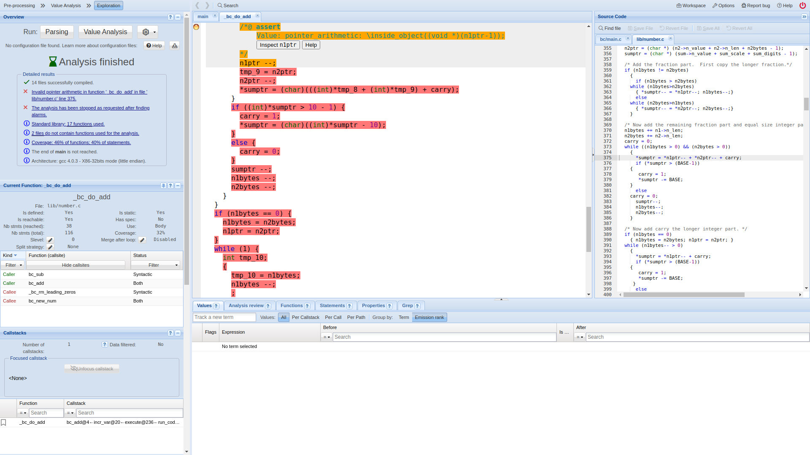

# Code Analysis for GNU Bc using TrustInSoft Analyzer

- [Code Analysis for GNU Bc using TrustInSoft Analyzer](#code-analysis-for-gnu-bc-using-trustinsoft-analyzer)
  - [Introduction](#introduction)
    - [Get the source code](#get-the-source-code)
    - [Source code structure](#source-code-structure)
  - [Find an fix an undefined behavior](#find-an-fix-an-undefined-behavior)
    - [Preparation](#preparation)
    - [Try the first test](#try-the-first-test)
    - [Fix the first test](#fix-the-first-test)
  - [Batch test with TrustInSoft CI using configuration file](#batch-test-with-trustinsoft-ci-using-configuration-file)
    - [Configuration file](#configuration-file)
    - [Analysis on the cloud with TrustInSoft CI](#analysis-on-the-cloud-with-trustinsoft-ci)
    - [Caveats under green lights](#caveats-under-green-lights)
  - [Fuzzing](#fuzzing)
    - [Get and build the AFL fuzzer](#get-and-build-the-afl-fuzzer)
    - [Rebuild GNU Bc with the fuzzer compiler](#rebuild-gnu-bc-with-the-fuzzer-compiler)
    - [Fuzzing](#fuzzing-1)
    - [Fix a fuzzed test](#fix-a-fuzzed-test)
  - [Conclusion](#conclusion)

## Introduction

This blog is a replay of the hands-on analysis of GNU Bc using the TrustInSoft Analyzer.
It demonstrates a few problems that one could encounter when analyzing a real world project.

### Get the source code

```shell-session
~$ wget https://ftp.gnu.org/gnu/bc/bc-1.07.1.tar.gz
~$ tar -xf bc-1.07.1.tar.gz
~$ cd bc-1.07.1
~/bc-1.07.1$
```

### Source code structure

GNU Bc, while equipped with most elementary functions and control flows, has a rather shallow structure in its source:
```shell-session
~/bc-1.07.1$ ls *
aclocal.m4  compile       COPYING      INSTALL      missing
ar-lib      config.h.in   COPYING.LIB  install-sh   NEWS
AUTHORS     configure     depcomp      Makefile.am  README
ChangeLog   configure.ac  FAQ          Makefile.in  ylwrap

bc:
bc.c      bc.y       fix-libmath_h  libmath.b  Makefile.am  sbc.y   storage.c
bcdefs.h  const.h    global.c       load.c     Makefile.in  scan.c  util.c
bc.h      execute.c  global.h       main.c     proto.h      scan.l  warranty.c

dc:
array.c  dc.h        dc-regdef.h  Makefile.am  misc.c     stack.c
dc.c     dc-proto.h  eval.c       Makefile.in  numeric.c  string.c

doc:
bc.1     bc.texi  dc.info  Makefile.am  texinfo.tex
bc.info  dc.1     dc.texi  Makefile.in  texi-ver.incl.in

Examples:
ckbook.b  pi.b  primes.b  twins.b

h:
getopt.h  number.h

lib:
getopt1.c  getopt.c  Makefile.am  Makefile.in  number.c  testmul.c  vfprintf.c

Test:
array.b   atan.b      div.b   jn.b   raise.b  sqrt1.b  testfn.b
arrayp.b  BUG.bc      exp.b   ln.b   signum   sqrt2.b  timetest
aryprm.b  checklib.b  fact.b  mul.b  sine.b   sqrt.b
```

The source files largely fall into five categories:
- build scripts and documentations
- source code under `bc/` for `bc`, the main calculator
- source code under `dc/` for `dc`, the reverse-polish style calculator, which is also part of GNU Bc
- source code under `lib/` and `h/`, used by both `bc` and `dc`
- tests under `Test/` and `Examples/` for `bc`

Since tests are provided only for `bc` but not for `dc`, we will focus on `bc` in this blog.

## Find an fix an undefined behavior

### Preparation

We have to make a few modifications to get the code accepted by the analyzer. The first complain from the analyzer is about the missing `config.h`:

```shell-session
~/bc-1.07.1$ tis-analyzer -I . -I bc -I h bc/*.c lib/*.c
...
bc/bcdefs.h:31:10: fatal error: 'config.h' file not found
#include "config.h"
```

But there is indeed no `config.h`:
```shell-session
~/bc-1.07.1$ find . -name config.h
(no results)
```

So it must be autogenerated by the build scripts, therefore we build the project with the canonical procedure and try again:
```shell-session
~/bc-1.07.1$ ./configure
~/bc-1.07.1$ make
~/bc-1.07.1$ tis-analyzer -I . -I bc -I h bc/*.c lib/*.c
...
lib/getopt.c:1135:[kernel] warning: def'n of func getopt at lib/getopt.c:1135 conflicts with the one at TIS_KERNEL_SHARE/libc/getopt.c:62; keeping the one at TIS_KERNEL_SHARE/libc/getopt.c:62.
lib/testmul.c:27:[kernel] warning: def'n of func out_of_memory at lib/testmul.c:27 conflicts with the one at bc/util.c:665; keeping the one at bc/util.c:665.
lib/testmul.c:38:[kernel] warning: def'n of func rt_error at lib/testmul.c:38 conflicts with the one at bc/util.c:767; keeping the one at bc/util.c:767.
lib/testmul.c:71:[kernel] warning: def'n of func rt_warn at lib/testmul.c:71 conflicts with the one at bc/util.c:803; keeping the one at bc/util.c:803.
lib/testmul.c:98:[kernel] warning: def'n of func out_char at lib/testmul.c:98 conflicts with the one at bc/util.c:311; keeping the one at bc/util.c:311.
lib/testmul.c:126:[kernel] warning: def'n of func main at lib/testmul.c:126 conflicts with the one at bc/main.c:164; keeping the one at bc/main.c:164.
...
```
Now come two new problems. The first is a name clash between the `getopt()` defined in `lib/getopt.c` and the one in the system c library.
To avoid any potential troubles, we rename the function `getopt` to `getopt_bc` throughout the package:
```shell-session
~/bc-1.07.1$ for i in $(find . -name '*.c'); do sed -i 's/\<getopt\>/getopt_bc/g; s/\<getopt_bc.h\>/getopt.h/g' $i; done
```
The other problem is caused by a misplaced test case `testmul.c` inside `lib/`. We excluded it from the source by renaming it:
```shell-session
~/bc-1.07.1$ mv lib/testmul.c lib/testmul.c.bak
```
Now the analyzer should be happy to compile it:
```shell-session
~/bc-1.07.1$ tis-analyzer -I . -I bc -I h bc/*.c lib/*.c
(no warning or error)
```

Let's see what happens in the [interpreter mode](https://man.trust-in-soft.com/tuto/getting-started.html):
```shell-session
~/bc-1.07.1$ tis-analyzer -I . -I bc -I h bc/*.c lib/*.c --interpreter
...
bc/main.c:171:[value] warning: Assigning with an extern function. Stopping.
                 stack: isatty :: bc/main.c:171 <- main
...
```
This is because tis-analyzer uses its own libc, in which `isatty` does not yet exist. We add a mock function in `lib/tis-mock.c` and try again:
```shell-session
~/bc-1.07.1$ echo 'int isatty(int) { return 0; }' >lib/tis-mock.c
~/bc-1.07.1$ tis-analyzer -I . -I bc -I h bc/*.c lib/*.c --interpreter
(no warning or error)
```
Now we are ready for a test.

### Try the first test

To run a Bc script, we can either provide the script to `bc` as an argument:
```shell-session
~/bc-1.07.1$ bc Test/array.b
...
This tests arrays!
...
(waiting for input)
```
which hangs waiting for further input, or we can redirect the script to the stdin of `bc`:
```shell-session
~/bc-1.07.1$ bc <Test/array.b
...
This tests array!
...
```

Either way, we have to use [tis-mkfs](https://man.trust-in-soft.com/man/tis-mkfs/tis-mkfs.html) to let the test script visible inside the tis-analyzer environment as a normal file
or as stdin (named as [`tis-mkfs-stdin`](https://man.trust-in-soft.com/man/tis-mkfs/tis-mkfs.html#file-generation)) and then add `-fs make_filesystem.c` to the command line.
Relaunch the analysis and we should find our first undefined behavior in GNU Bc.

```shell-session
~/bc-1.07.1$ tis-mkfs -local "tis-mkfs-stdin:Test/array.b"
~/bc-1.07.1$ tis-analyzer -I. -I bc -I bc/*.c lib/*.c -fs make_filesystem.c --interpreter
...
This tests arrays!

lib/number.c:375:[kernel] warning: pointer arithmetic: assert \inside_object((void *)(n1ptr-1));
                  stack: _bc_do_add :: lib/number.c:574 <-
                         bc_add :: bc/storage.c:816 <-
                         incr_var :: bc/execute.c:317 <-
                         execute :: bc/util.c:295 <-
                         run_code :: /home/bc/bc.y:134 <-
                         yyparse :: bc/main.c:260 <-
                         main
...
```

### Fix the first test

To inspect the undefined behavior, we rerun the analysis with option `-gui`:
```shell-session
~/bc-1.07.1$ tis-analyzer -I. -I bc -I bc/*.c lib/*.c -fs make_filesystem.c --interpreter -gui
...
[TrustInSoft Analyzer] You can launch the GUI with:
     chromium-browser http://localhost:8080/
```
Open http://localhost:8080/ in your browser and wait for a few seconds, we should see the graphical interface:



When opening the GUI for the first time, the undefined behavior <span style="background-color: orange">**highlighted in orange**</span> should be automatically located in the middle panel where every implicit conversion and micro-operations are made explicit,
while the corresponding original code <span style="background: rgba(0, 0, 0, 0.07)">**highlighted in grey**</span> should be shown on the right.
In case this didn't happen, click the error '_Invalid pointer arithmetic ..._' on the top left panel.

As told by the highlighted alarm, the undefined behavior is literally because we are trying to calculate `n1ptr-1` which does not result in a pointer inside any valid object. To inspect a bit further what happened,
click the `inspect n1ptr` button in the orange alarm. We can see in the bottom panel that, before the undefined behavior happens, `n1ptr` pointed to the beggining of an allocated array (`__malloc_bc_new_num_l79`).
Luckily, the code on the right panel is clear enough for us to expalin without further inspectation why a pointer pointing to the beginning of an array could be decreased here:
```c
...
351    /* Start with the fraction part.  Initialize the pointers. */
352    n1bytes = n1->n_scale;
353    n2bytes = n2->n_scale;
354    n1ptr = (char *) (n1->n_value + n1->n_len + n1bytes - 1);
355    n2ptr = (char *) (n2->n_value + n2->n_len + n2bytes - 1);
356    sumptr = (char *) (sum->n_value + sum_scale + sum_digits - 1);
357  
358    /* Add the fraction part.  First copy the longer fraction.*/
359    if (n1bytes != n2bytes)
360      {
361        if (n1bytes > n2bytes)
362  	while (n1bytes>n2bytes)
363  	  { *sumptr-- = *n1ptr--; n1bytes--;}
364        else
365  	while (n2bytes>n1bytes)
366  	  { *sumptr-- = *n2ptr--; n2bytes--;}
367      }
368  
369    /* Now add the remaining fraction part and equal size integer parts. */
370    n1bytes += n1->n_len;
371    n2bytes += n2->n_len;
372    carry = 0;
373    while ((n1bytes > 0) && (n2bytes > 0))
374      {
375        *sumptr = *n1ptr-- + *n2ptr-- + carry;
376        if (*sumptr > (BASE-1))
377  	{
378  	   carry = 1;
379  	   *sumptr -= BASE;
380  	}
381        else
382  	carry = 0;
383        sumptr--;
384        n1bytes--;
385        n2bytes--;
386      }
...
```

From `n1ptr = (char *) (n1->n_value + n1->n_len + n1bytes - 1)` on line 354 and `n1ptr--` inside the loops, we can reasonably infer that `n1ptr` is being used as a loop pointer starting from the last element of an array and is decreased after each loop, and will of course end up being one before the first element of the array (hence the invalid `n1ptr-1`) once the loop ends.

The standard fix to this problem is to make the loop pointer start as a "one-past-the-end" pointer. Concretely, on the right panel, we remove the `- 1` from line 354 and change `n1ptr--` into `--n1ptr` on line 363 and 375m save the file, click 'Parsing and then 'Value Analysis' in the top left panel, and we can see that the alarm has indeed moved from `n1ptr--` to the `n2ptr--` following it.

Now let's fix all such pointer errors in `lib/number.c:_bc_do_add`:

<details>
<summary>
Fix of the first undefined behavior
</summary>

```diff
354,356c354,356
<   n1ptr = (char *) (n1->n_value + n1->n_len + n1bytes - 1);
<   n2ptr = (char *) (n2->n_value + n2->n_len + n2bytes - 1);
<   sumptr = (char *) (sum->n_value + sum_scale + sum_digits - 1);
---
>   n1ptr = (char *) (n1->n_value + n1->n_len + n1bytes);
>   n2ptr = (char *) (n2->n_value + n2->n_len + n2bytes);
>   sumptr = (char *) (sum->n_value + sum_scale + sum_digits);
363c363
< 	  { *sumptr-- = *n1ptr--; n1bytes--;}
---
> 	  { *--sumptr = *--n1ptr; n1bytes--;}
366c366
< 	  { *sumptr-- = *n2ptr--; n2bytes--;}
---
> 	  { *--sumptr = *--n2ptr; n2bytes--;}
375c375
<       *sumptr = *n1ptr-- + *n2ptr-- + carry;
---
>       *--sumptr = *--n1ptr + *--n2ptr + carry;
383c383
<       sumptr--;
---
> 
393c393
<       *sumptr = *n1ptr-- + carry;
---
>       *--sumptr = *--n1ptr + carry;
401c401
<       sumptr--;
---
> 
406c406
<     *sumptr += 1;
---
>     *--sumptr += 1;
```
</details>

Save the file, click 'Parsing' and 'Value Analysis' again, and we should see from the upper left panel:
> <span style="color:green">✓</span> There is no undefined behavior on this tested path.

## Batch test with TrustInSoft CI using configuration file

### Configuration file

To avoid typing all the command line arguments for each test, we can manage the tests with a [configuration file](https://docs.ci.trust-in-soft.com/reference/configuration-file), named `tis.config`, which contains an array of json objects, each of which describe one test.
Here we write a python script to generate the json array:

```python
import json
import sys
from pathlib import Path

config = [
    {
        "name" : Path(f).stem,
        "filesystem": {
            "files": [
                {
                    "name": "tis-mkfs-stdin",
                    "from": f
                    }
                ]
            },
        "include": "tis-common.config"
    } for f in sys.argv[1:]
]

print(json.dumps(config, sort_keys=True, indent=4))
```

Run this script:
```shell-session
~/bc-1.07.1$ python3 gen-tis-config.py Test/*.b >tis.config
```
We should have a `tis.config` that looks like the following:
```json
[
    {
        "filesystem": {
            "files": [
                {
                    "from": "Test/array.b",
                    "name": "tis-mkfs-stdin"
                }
            ]
        },
        "include": "tis-common.config",
        "name": "array",
    },
    {
        "filesystem": {
            "files": [
                {
                    "from": "Test/arrayp.b",
                    "name": "tis-mkfs-stdin"
                }
            ]
        },
        "include": "tis-common.config",
        "name": "arrayp",
    },
    // ...configurations with "name": "aryprm", "name": "atan", "name": "checklib"...
]
```


The file `tis-common.config` contains common arguments for all tests:
```json
{
    "cpp-extra-args": "-Ibc -I. -Ih -DTIS_DETERMINISTIC_LIBC",
    // the next two lines together are equivalent with "--interpreter" on the command line
    "val": true,
    "val-profile": "interpreter",
    "files": [
        "lib/tis-mock.c",
        "lib/number.c",
        "lib/vfprintf.c",
        "lib/getopt.c",
        "lib/getopt1.c",
        "bc/global.c",
        "bc/util.c",
        "bc/execute.c",
        "bc/bc.c",
        "bc/scan.c",
        "bc/load.c",
        "bc/warranty.c",
        "bc/main.c",
        "bc/storage.c"
    ]
}
```

Now we can run any test under `Test/` by specifying its name. For example, to relaunch the test for `array.b` demostrated above, we can run:
```shell-session
~/bc-1.07.1$ tis-analyzer -tis-config-load tis.config -tis-config-select-by-name array -gui
```

### Analysis on the cloud with TrustInSoft CI

TrustInSoft ships with support for Continuous Integration (CI) that analyses github repositories remotely. To use it, we create an empty public repository named `bc-tis` on github, then initialize the local repository as follows:

```shell-session
~/bc-1.07.1$ git init
~/bc-1.07.1$ cat >.gitignore <<EOF
*.o
*.a
bc/bc
dc/dc
.tis-kernel/
Makefile
.deps/
config.log
config.status
texi-ver.incl
stamp-h1
__vfs-tis-*
autom4te.cache
EOF
~/bc-1.07.1$ git stage .gitignore
~/bc-1.07.1$ git stage *
~/bc-1.07.1$ git commit -m 'init'
~/bc-1.07.1$ git remote add origin 'git@github.com:your-user-name/bc-tis.git'
~/bc-1.07.1$ git push -u origin master
```
Now we login [TrustInSoft CI](https://ci.trust-in-soft.com/signin) with our GitHub account, select `bc-tis` in the 'Add Project' page, and click 'Start verifying':


Wait for around ten minutes, we should see the results of all tests:


By clicking 'Explore' on the right of `aryprm`, we have again the graphical interface of tis-analyzer showing the details of the found undefined behavior.
This time, the error is again caused by postfix decrement of pointers but in other functions, so we skip the inspection here.
Below is a fix of `lib/number.c` for all such errors:

<details>
<summary>Fix of all before-one pointer errors</summary>

```diff
444,446c444,446
<   n1ptr = (char *) (n1->n_value + n1->n_len + n1->n_scale -1);
<   n2ptr = (char *) (n2->n_value + n2->n_len + n2->n_scale -1);
<   diffptr = (char *) (diff->n_value + diff_len + diff_scale -1);
---
>   n1ptr = (char *) (n1->n_value + n1->n_len + n1->n_scale);
>   n2ptr = (char *) (n2->n_value + n2->n_len + n2->n_scale);
>   diffptr = (char *) (diff->n_value + diff_len + diff_scale);
456c456
< 	*diffptr-- = *n1ptr--;
---
> 	*--diffptr = *--n1ptr;
463c463
< 	  val = - *n2ptr-- - borrow;
---
> 	  val = - *--n2ptr - borrow;
471c471
< 	  *diffptr-- = val;
---
> 	  *--diffptr = val;
479c479
<       val = *n1ptr-- - *n2ptr-- - borrow;
---
>       val = *--n1ptr - *--n2ptr - borrow;
487c487
<       *diffptr-- = val;
---
>       *--diffptr = val;
495c495
< 	  val = *n1ptr-- - borrow;
---
> 	  val = *--n1ptr - borrow;
503c503
< 	  *diffptr-- = val;
---
> 	  *--diffptr = val;
650,652c650,652
<   n1end = (char *) (n1->n_value + n1len - 1);
<   n2end = (char *) (n2->n_value + n2len - 1);
<   pvptr = (char *) ((*prod)->n_value + prodlen - 1);
---
>   n1end = (char *) (n1->n_value + n1len);
>   n2end = (char *) (n2->n_value + n2len);
>   pvptr = (char *) ((*prod)->n_value + prodlen);
656c656
<   for (indx = 0; indx < prodlen-1; indx++)
---
>   for (indx = 1; indx < prodlen; indx++)
658,662c658,662
<       n1ptr = (char *) (n1end - MAX(0, indx-n2len+1));
<       n2ptr = (char *) (n2end - MIN(indx, n2len-1));
<       while ((n1ptr >= n1->n_value) && (n2ptr <= n2end))
< 	sum += *n1ptr-- * *n2ptr++;
<       *pvptr-- = sum % BASE;
---
>       n1ptr = (char *) (n1end - MAX(0, indx-n2len));
>       n2ptr = (char *) (n2end - MIN(indx, n2len));
>       while ((n1ptr > n1->n_value) && (n2ptr < n2end))
> 	sum += *--n1ptr * *n2ptr++;
>       *--pvptr = sum % BASE;
665c665
<   *pvptr = sum;
---
>   *--pvptr = sum;
686,687c686,687
< 			 accum->n_len + accum->n_scale - shift - 1);
<   valp = (signed char *)(val->n_value + val->n_len - 1);
---
> 			 accum->n_len + accum->n_scale - shift);
>   valp = (signed char *)(val->n_value + val->n_len);
693c693
<       *accp -= *valp-- + carry;
---
>       *--accp -= *--valp + carry;
696c696
<         *accp-- += BASE;
---
>         *accp += BASE;
699c699
< 	accp--;
---
> 
703c703
<       *accp -= carry;
---
>       *--accp -= carry;
705c705
< 	*accp-- += BASE;
---
> 	*accp += BASE;
712c712
<       *accp += *valp-- + carry;
---
>       *--accp += *--valp + carry;
715c715
<         *accp-- -= BASE;
---
>         *accp -= BASE;
718c718
< 	accp--;
---
> 
722c722
<       *accp += carry;
---
>       *--accp += carry;
724c724
< 	*accp-- -= BASE;
---
> 	*accp -= BASE;
882,883c882,883
< 	  nptr = (unsigned char *) (num+size-1);
< 	  rptr = (unsigned char *) (result+size-1);
---
> 	  nptr = (unsigned char *) (num+size);
> 	  rptr = (unsigned char *) (result+size);
888,889c888,889
< 	      value = *nptr-- * digit + carry;
< 	      *rptr-- = value % BASE;
---
> 	      value = *--nptr * digit + carry;
> 	      *--rptr = value % BASE;
893c893
< 	  if (carry != 0) *rptr = carry;
---
> 	  if (carry != 0) *--rptr = carry;
938,939c938,939
<   n2ptr = (unsigned char *) n2->n_value+n2->n_len+scale2-1;
<   while ((scale2 > 0) && (*n2ptr-- == 0)) scale2--;
---
>   n2ptr = (unsigned char *) n2->n_value+n2->n_len+scale2;
>   while ((scale2 > 0) && (*--n2ptr == 0)) scale2--;
1033,1034c1033,1034
< 	      ptr1 = (unsigned char *) num1+qdig+len2;
< 	      ptr2 = (unsigned char *) mval+len2;
---
> 	      ptr1 = (unsigned char *) num1+qdig+len2+1;
> 	      ptr2 = (unsigned char *) mval+len2+1;
1037c1037
< 		  val = (int) *ptr1 - (int) *ptr2-- - borrow;
---
> 		  val = (int) *--ptr1 - (int) *--ptr2 - borrow;
1045c1045
< 		  *ptr1-- = val;
---
> 		  *ptr1 = val;
1053,1054c1053,1054
< 	      ptr1 = (unsigned char *) num1+qdig+len2;
< 	      ptr2 = (unsigned char *) n2ptr+len2-1;
---
> 	      ptr1 = (unsigned char *) num1+qdig+len2+1;
> 	      ptr2 = (unsigned char *) n2ptr+len2;
1058c1058
< 		  val = (int) *ptr1 + (int) *ptr2-- + carry;
---
> 		  val = (int) *--ptr1 + (int) *--ptr2 + carry;
1066c1066
< 		  *ptr1-- = val;
---
> 		  *ptr1 = val;
1068c1068
< 	      if (carry == 1) *ptr1 = (*ptr1 + 1) % 10;
---
> 	      if (carry == 1) { --ptr1; *ptr1 = (*ptr1 + 1) % 10; }
```
</details>

```shell-session
~/bc-1.07.1$ git commit -am 'fix all invalid one-before pointer errors'
~/bc-1.07.1$ git push
```

Now half of the undefined behaviors should either disappear or become "Out of memory" errors.


### Caveats under green lights

After the brief excitement of seeing the green lights, we should notice that `ln` finish under one minutes, while much simpler operations like `mul` and `div` don't stop until they run out of memory. The reason can be found in the "Analyzer Log":
```
...
Runtime error (func=(main), adr=70): 
Function l not defined.
...
```
which means that, due to missing libraries, the function `ln` is not executed at all, but such runtime error of bc is not detected by the analyzer of undefined behavior of C. To eliminate such false negatives, we follow the documentation of GNU Bc and add `"-val-args": " -l"` to `tis.config`, then try again:


Now only 1 undefined behavior remains while all the rest become "Out of memory".

The undefined behavior in the test `jn` can be simplified into `memset(arr + len, 0, 0)`, where `len` is the length of the array that `arr` points to.
`memset` implicitly requires the first argument to ’point to an object’, while `arr + len`, being a valid pointer, does not point to any element of the array.
It is not specified unambiguously in the C standards whether this is an undefined behavior (see [remarks from Pascal Cuoq](https://musl.openwall.narkive.com/skiWxN6i/documentation-of-memcpy-and-undefined-behavior-in-memset) and [discussions on Stack Overflow](https://stackoverflow.com/questions/25390577/is-memcpya-1-b-1-0-defined-in-c11)). We fix it anyway to avoid risks:

```diff
927c927
< 	  memset (&qval->n_value[n1->n_len],0,scale);
---
> 	  if (scale > 0) memset (&qval->n_value[n1->n_len],0,scale);
```

The Out-of-memory errors are more of an unfortunate but inevitable cost of the analyzer itself than a problem of GNU Bc being analyzed.
When following the loops, tis-analyzer records and tracks the values during each loop, so the memory usage could be amplifyed by tis-analyzer in proportion
to the number of loops being executed <span style="color: red">(FIXME: is this correct?)</span>. The remedy here is to reduce the number of loops in the tests. We also add `"no-results": true` to the configuration file, which saves memory and reduces runtime.

<details>
<summary>Reduce the sizes of the tests</summary>

```diff
diff --git a/Test/atan.b b/Test/atan.b
index e742279..691d04a 100644
--- a/Test/atan.b
+++ b/Test/atan.b
@@ -1,5 +1,5 @@
-for (a=0; a<1000; a+=2) x=a(a)
+for (a=0; a<10; a+=2) x=a(a)
 x
-for (a=0; a<2; a+=.01) x=a(a)
+for (a=0; a<1; a+=.2) x=a(a)
 x
 quit
diff --git a/Test/checklib.b b/Test/checklib.b
index 44c1fac..726fb89 100644
--- a/Test/checklib.b
+++ b/Test/checklib.b
@@ -45,7 +45,7 @@ Percent failed: "; scale = 2; c*100/b;
    b, l and i are not reset.
 */
 
-if (b == 0) { b = 10; l = 61; i = 10; }
+if (b == 0) { b = 10; l = 31; i = 10; }
 
 "
 Checking e(x)"
@@ -55,7 +55,7 @@ define f(x) {
 for (s=10; s<l; s=s+i) {
 "
 scale = "; s
-j = t(0,200,1,s,s+4)
+j = t(0,2,1,s,s+4)
 }
 
 "
@@ -66,7 +66,7 @@ define f(x) {
 for (s=10; s<l; s=s+i) {
 "
 scale = "; s
-j = t(1,10000,25,s,s+4)
+j = t(1,10,25,s,s+4)
 }
 
 "
@@ -77,7 +77,7 @@ define f(x) {
 for (s=10; s<l; s=s+i) {
 "
 scale = "; s
-j = t(0,8*a(1),.01,s,s+4)
+j = t(0,8*a(1),.6,s,s+4)
 }
 
 "
@@ -88,7 +88,7 @@ define f(x) {
 for (s=10; s<l; s=s+i) {
 "
 scale = "; s
-j = t(-1000,1000,10,s,s+4)
+j = t(-10,10,10,s,s+4)
 }
 
 "
@@ -100,10 +100,10 @@ for (s=10; s<l; s=s+i) {
 "
 n=0, scale = "; s
 n=0
-j = t(0,30,.1,s,s+4)
+j = t(0,3,.6,s,s+4)
 "
 n=1, scale = "; s
 n=1
-j = t(0,30,.1,s,s+4)
+j = t(0,3,.6,s,s+4)
 }
 
diff --git a/Test/div.b b/Test/div.b
index 3c7d377..96ffe48 100644
--- a/Test/div.b
+++ b/Test/div.b
@@ -1,7 +1,7 @@
-scale = 20
+scale = 5
 a=2/3
-for (i=0; i<1000; i++) {
-  for (j=1; j<100; j++) b=a/j
+for (i=0; i<10; i++) {
+  for (j=1; j<10; j++) b=a/j
 }
 b
 quit
diff --git a/Test/exp.b b/Test/exp.b
index 92c482c..aba57f7 100644
--- a/Test/exp.b
+++ b/Test/exp.b
@@ -1,3 +1,3 @@
-for (a=0; a<180; a+=.4) x=e(a)
+for (a=0; a<18; a+=.9) x=e(a)
 x
 quit
diff --git a/Test/fact.b b/Test/fact.b
index 1bf850a..2b804ca 100644
--- a/Test/fact.b
+++ b/Test/fact.b
@@ -4,7 +4,7 @@ define f (x) {
   return (f(x-1)*x)
 }
 
-for (a=1; a<600; a++) b=f(a)
+for (a=1; a<20; a++) b=f(a)
 "length(b)= "; length(b)
 quit
 
diff --git a/Test/jn.b b/Test/jn.b
index a4e0624..f1fa197 100644
--- a/Test/jn.b
+++ b/Test/jn.b
@@ -1,6 +1,6 @@
-scale = 50
-for (a=0; a<=100; a += 20) {
-  for (b=0; b<=300; b += 20) x=j(a,b)
+scale = 3
+for (a=0; a<=1; a += 1) {
+  for (b=0; b<=3; b += 3) x=j(a,b)
   x
 }
 quit
diff --git a/Test/ln.b b/Test/ln.b
index cd00232..84d366c 100644
--- a/Test/ln.b
+++ b/Test/ln.b
@@ -1,4 +1,4 @@
-scale = 60
-for (a=1; a<100000000000000000000000000000000000000; a = a*2) x=l(a)
+scale = 10
+for (a=1; a<1000000000; a = a*2) x=l(a)
 x
 quit
diff --git a/Test/mul.b b/Test/mul.b
index 722086f..3337c9f 100644
--- a/Test/mul.b
+++ b/Test/mul.b
@@ -1,11 +1,11 @@
-scale = 20
-for (i=0; i<10000; i++) {
-  for (j=1; j<100; j++) b=i*j
+scale = 10
+for (i=0; i<10; i++) {
+  for (j=1; j<10; j++) b=i*j
 }
 b
-for (i=0; i<10000; i++) {
-  for (j=1000000000000000000000000000000000000000000000000000000000000000000; \
-       j<1000000000000000000000000000000000000000000000000000000000000000100; \
+for (i=0; i<10; i++) {
+  for (j=10000000000000; \
+       j<10000000000010; \
        j++) b=i*j
 }
 b
diff --git a/Test/raise.b b/Test/raise.b
index a4314a0..7075a52 100644
--- a/Test/raise.b
+++ b/Test/raise.b
@@ -1,7 +1,7 @@
-for (i=0; i<1000; i++) a = 2^i;
+for (i=0; i<10; i++) a = 2^i;
 length(a)
-for (i=3000; i<3100; i++) a = 3^i;
+for (i=3000; i<3010; i++) a = 3^i;
 length(a)
-for (i=200; i<220; i++) a = (4^100)^i;
+for (i=20; i<21; i++) a = (4^10)^i;
 length(a)
 quit
diff --git a/Test/sine.b b/Test/sine.b
index 18c4b57..2e48c33 100644
--- a/Test/sine.b
+++ b/Test/sine.b
@@ -1,5 +1,5 @@
-for (i=0; i<8*a(1); i=i+.01) x=s(i)
+for (i=0; i<8*a(1); i=i+.6) x=s(i)
 x
-for (i=i; i<16*a(1); i=i+.01) x=s(i+.1234123412341234)
+for (i=i; i<16*a(1); i=i+.6) x=s(i+.1234)
 x
 quit
diff --git a/Test/sqrt.b b/Test/sqrt.b
index 3fb548c..0353e45 100644
--- a/Test/sqrt.b
+++ b/Test/sqrt.b
@@ -1,13 +1,7 @@
 scale = 5
-for (a=1; a<500; a++) r=sqrt(a)
+for (a=1; a<10; a++) r=sqrt(a)
 r
 scale = 10
-for (a=1; a<500; a++) r=sqrt(a)
-r
-scale = 25
-for (a=1; a<500; a++) r=sqrt(a)
-r
-scale = 40
-for (a=1; a<500; a++) r=sqrt(a)
+for (a=1; a<10; a++) r=sqrt(a)
 r
 quit
diff --git a/Test/sqrt1.b b/Test/sqrt1.b
index c3ca269..afbc909 100644
--- a/Test/sqrt1.b
+++ b/Test/sqrt1.b
@@ -1,8 +1,8 @@
-for (j=0; j<10; j++) {
+for (j=0; j<3; j++) {
   a = .9;
   b = .9+j;
   scale = 2;
-  for (i=0; i<90; i++) {
+  for (i=0; i<3; i++) {
     scale += 1;
     a /= 10;
     b += a;
diff --git a/Test/sqrt2.b b/Test/sqrt2.b
index bd0eaad..caf5b3e 100644
--- a/Test/sqrt2.b
+++ b/Test/sqrt2.b
@@ -1,10 +1,10 @@
-scale = 20
-for (a=1; a<5000; a += 1) r=sqrt(a)
+scale = 10
+for (a=1; a<50; a += 10) r=sqrt(a)
 r
-for (a=1; a<50000; a += 100) r=sqrt(a)
+for (a=1; a<500; a += 100) r=sqrt(a)
 r
-for (a=1; a<500000; a+=1000) r=sqrt(a)
+for (a=1; a<5000; a+=1000) r=sqrt(a)
 r
-for (a=1; a<5000000; a+=10000) r=sqrt(a)
+for (a=1; a<50000; a+=10000) r=sqrt(a)
 r
 quit
```
</details>

Now most tests should be passed.


## Fuzzing

Fuzzing is a debugging technique that discovers crash triggering inputs by automatically monitoring and exhausting the executing paths of the program.
Here, we will fix one undefined behavior found with the help of the AFL fuzzer.

### Get and build the AFL fuzzer
```shell-session
~$ wget https://github.com/google/AFL/archive/refs/tags/v2.57b.tar.gz
~$ tar -xf v2.57b.tar.gz
~$ cd AFL-2.57b
~/AFL-2.57b$ make
```
### Rebuild GNU Bc with the fuzzer compiler

```shell-session
~/AFL-2.57b$ cd ../bc-1.07.1
~/bc-1.07.1$ CC=$PWD/../AFL-2.57b/ ./configure
~/bc-1.07.1$ make
```

### Fuzzing
```shell-session
~/bc-1.07.1$ mkdir afl-in
~/bc-1.07.1$ cp Test/*.b afl-in
~/bc-1.07.1$ afl-fuzz -i afl-in -o afl-out -- bc/bc @@
```

If you receive the error below:

    > Hmm, your system is configured to send core dump notifications to an
    > external utility. This will cause issues: there will be an extended delay
    > between stumbling upon a crash and having this information relayed to the
    > fuzzer via the standard `waitpid()` API.
    >
    > To avoid having crashes misinterpreted as timeouts, please log in as root
    > and temporarily modify `/proc/sys/kernel/core_pattern`, like so:
    >
    > `echo core >/proc/sys/kernel/core_pattern`

then follow the suggestion and relaunch the fuzzing:

```shell-session
~/bc-1.07.1$ echo core |sudo tee /proc/sys/kernel/core_pattern
~/bc-1.07.1$ export AFL_SKIP_FREQ=1
~/bc-1.07.1$ afl-fuzz -i afl-in -o afl-out -- bc/bc @@
```

We should see


The most interesting outputs from the fuzzer are under `afl-out/crashes`, each of which is an input that triggers a crash in the program, which almost always comes from an undefined behavior. Like before, we push the tests and the generated configuration to TrustInSoft CI.

```shell-session
~/bc-1.07.1$ python3 ./gen-tis-config.py afl-out/crashes/* >tis.config
~/bc-1.07.1$ git stage tis.config afl-out/crashes
~/bc-1.07.1$ git commit -m 'add fuzzed tests'
~/bc-1.07.1$ git push
```

We can see that the fuzzer has indeed helped us find new undefined behaviors:


### Fix a fuzzed test

Click into the first test:


It is usually difficult to debug without knowing what the code intends to do, but thanks to the rich information recorded by tis-analyzer, we can collect the context information needed for debugging a specific bug. Right-click the second `params` inside the line `params = params->next` and click "Show Defs":


It means that the problematic `params` is a result of `params++`. By typing `params->next` into the box in the bottom panel, we can see that the statement `params++` indeed makes `params->next` invalid.


This is in accordance with an implication of the alarm: when tis-analyzer says that the invalidity of `params->next` is the first trouble being found, it asserts implicitly at the same time that `params` is valid. There is only two cases where a member of a valid pointer could be invalid: the case where the member is inside a union, and the case where the pointer does not point to an object, that is, it points to the "one past the end" of an object or an array. Since no union is involved here, only the latter case is relevant, and pointer arithmetics like `params++` are indeed very likely the cause of it.

Repeat the procedure: right-click the highlighted "params" and click "Show Defs":


We can see that the `params` is always a linked list and is never an array of any sort, so `params++` does not make sense at all. We can replace it with `abort()`. Relaunch the analyzer and this undefined behavior should gone.

## Conclusion

With the help of TrustInSoft analyzer, we found three undefined behaviors in the latest version of GNU Bc and fixed them all.
This is a real-world proof of the analyzer's ability of finding bugs that have survived decades of tests from numerous users.
Meanwhile, the proof is less than complete:
1. To be adapted to the analyzer, the tests shipped with GNU Bc have to be drastically reduced in loop size.
2. Testcase-based analyses are intrinsically incomplete. Fuzzer bridges completenss with feasibility, but at the end of the day, it provides no formal guarantee.
3. The real power of TrustInSoft analyzer is abstract interpretation. Unfortunately, calculators do not behave well when interpreted abstractly, which is why we skipped the demonstration of the major component of the analyzer.